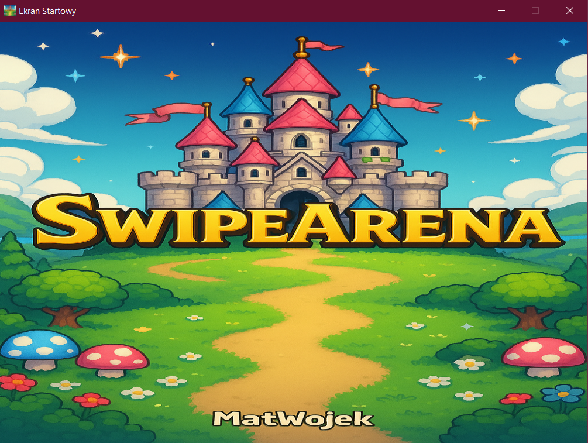
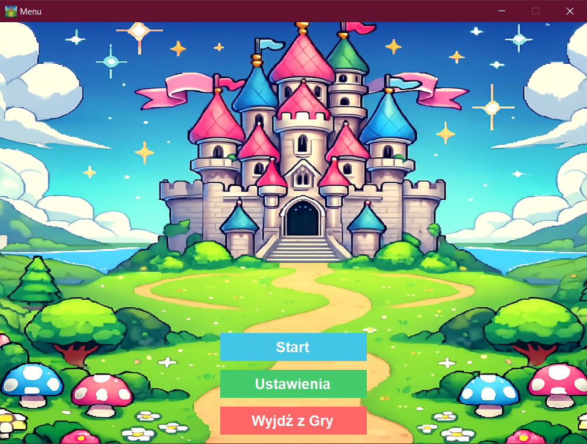
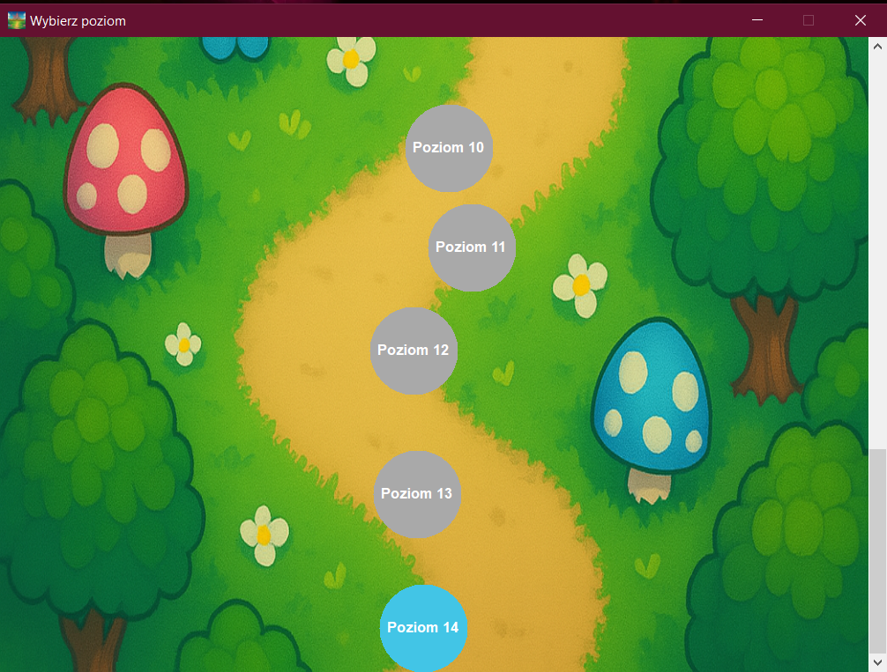
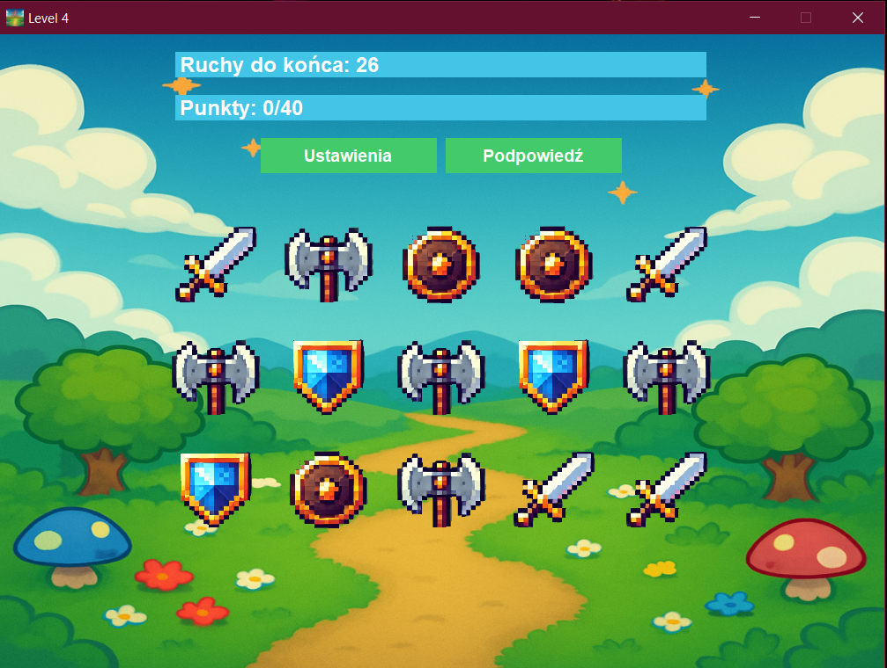
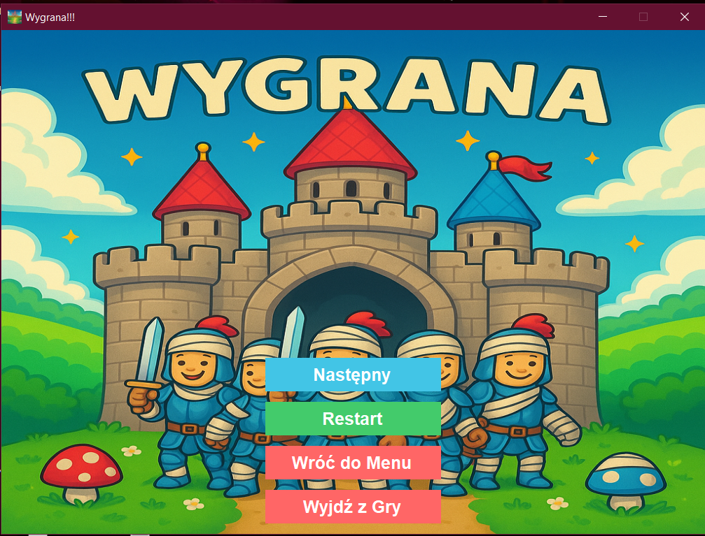
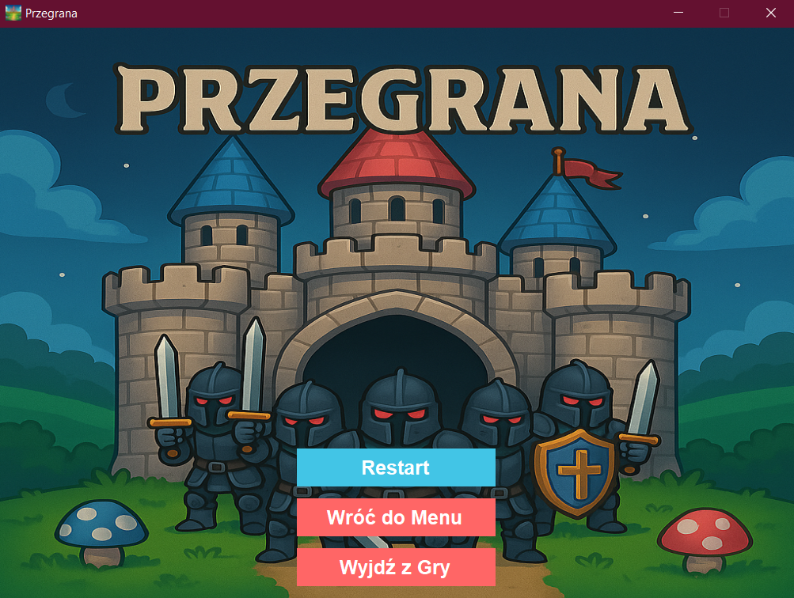
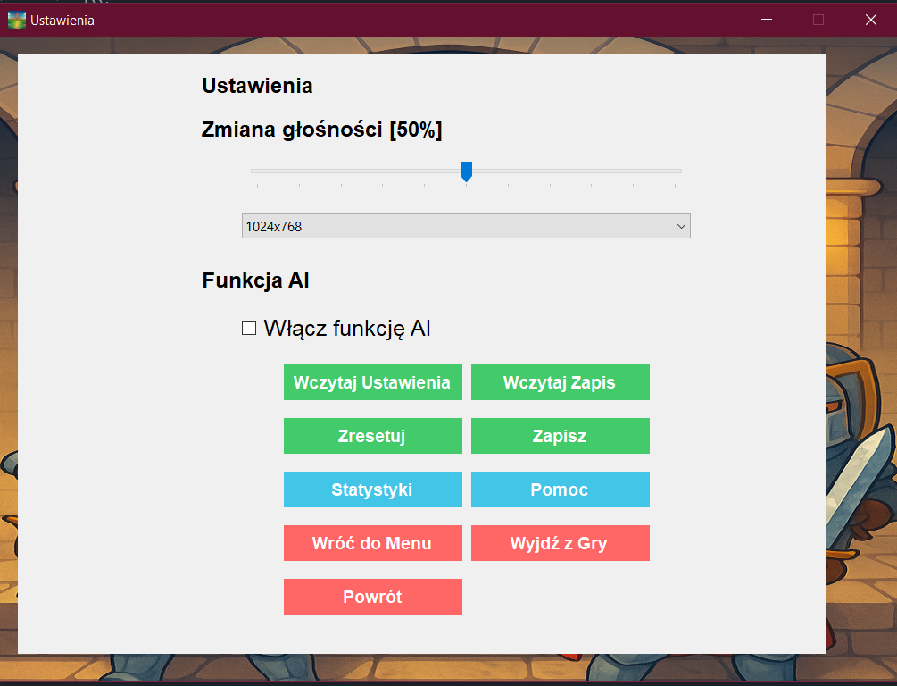

# SwipeArena
---

## ✅ Funkcjonalności

- ✅ Menu główne z wyborem: **Start, Ustawienia, Wyjście**
- ✅ Obsługa wielu poziomów - taki slider do przewijania po poziomach z góry na dół (scroll)
- ✅ 15 losowo generowanych poziomów
- ✅ Ekran „Wygrana” i „Przegrana”
- ✅ Statystyki gracza 
- ✅ Ustawienia gry (np. dźwięk, ustawienia rozdzielczości, wczytanie zapisu, wczytanie ustawień)
- ✅ Automatyczny zapis w trakcie gry i po grze (w plikach JSON) 
- ✅ Skalowalny interfejs, który dopasowuje się do okna po zmianie rozdzielczości 
- ✅ **AI Bot** – automatyczne podpowiedzi lub pełna gra przez komputer

---

## 🚀 Jak rozpocząć

1. Otwórz projekt w **Visual Studio**
2. Skonfiguruj projekt jako aplikację Windows Forms
3. Ustaw `Form1.cs` jako startowy formularz
4. Uruchom (F5)

---

## 🧠 AI Bot – co robi?

Plik: `AIHelper.cs`

**Tryby działania:**

- 🔍 **Tryb podpowiedzi**: analiza planszy i sugestia najlepszego ruchu, zaznacza najlepsze do połączenia obiekty
- 🤖 **Tryb auto-gracza**: bot automatycznie wykonuje ruchy za gracza

### Działanie dla AI:
1. Przeskanuj planszę
2. Wyszukaj możliwe kombinacje (min. 3 w rzędzie)
3. Oblicz wartość punktową każdej kombinacji
4. Wybierz najlepszą i:
   - zaznacz (w trybie podpowiedzi)
   - wykonaj (w trybie auto)

---

## 🧩 Przyszłe rozszerzenia

- 🎨 Zmiana skórki / motywów graficznych (np. przy większej ilości poziomów)
- 🎆 Ulepszenie animacji
- 🌐 Tryb multiplayer LAN lub online
- 📱 Port na Androida (Xamarin)

---

## 🛠 Technologie

- C# (.NET Framework / .NET 6+)
- Windows Forms
- Algorytmy wyszukiwania i heurystyki (dla AI)

---

## 📸 Screenshoty

### Widok Ekranu Startowego Gry

### Widok Menu Gry

### Widok Wybierania Poziomu w Grze

### Widok Poziomu

### Widok Wygranej

### Widok Przegranej 

### Widok Ustawień

---

## 👨‍💻 Autor
Stworzony przez MatWojek
Projekt edukacyjno-rozrywkowy w stylu puzzle match-3.

